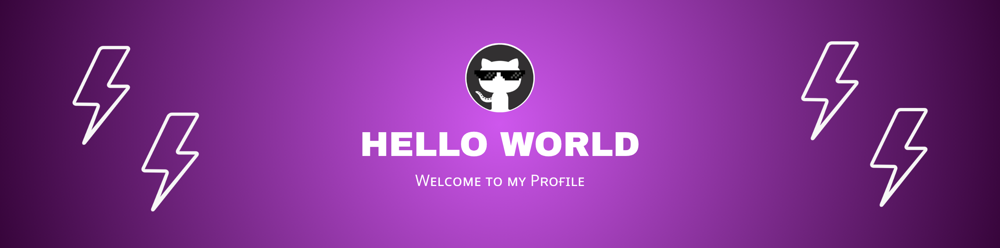

  

#  ɪ'ᴍ Fᴀʙɪᴀɴ! 
*Software Engineering Student | Future Cloud Architect & Data Engineer*
  

I am a Software Engineering student from Peru 🇵🇪. Passionate about scalable architectures, problem-solving, and the future of Artificial Intelligence.

- ⚙️ Focused on improving my skills in **Data Engineering, Cloud Architecture, and Backend Development**.
- 📚 **I’m currently learning:** Computer Networks, Python, Cloud Computing (AWS prep), and Ubuntu Server.
- 📡 **Looking to collaborate on:** intelligent agent automation projects (hands-on experience with **n8n**).
- 🗣️ **Ask me about:** complex **C++ algorithms**, backend logic, or my experience at the 🏰 **Disney International Program**, I'll be glad to help 😉.
- 🤝 **Career Goal:** Actively open to **internship opportunities** (July - December).
- ⛪ **Outside tech:** Astronomy 🌌, university dance troupe 🕺, guitar 🎸, video games 🎮, and catechist. 🌍 Next big goal: Master's degree in Germany! 🇩🇪

  

---
 

## 🛠 &nbsp;Tech Stack

#### 🔧 Languages

#### 🌐 Frameworks & Frontend

#### 🗄️ Databases & Cloud

#### 🔧 Tools & Environment

## 📊 Profile Statistics

## 📊 Activity & Statistics

  

  

---

### 🔗 &nbsp;Contact Me

  
  
  
  
  

---

<h6 align="center">👇🏻 Here is a list of the Open Source projects I work on: 👇🏻</h6>
